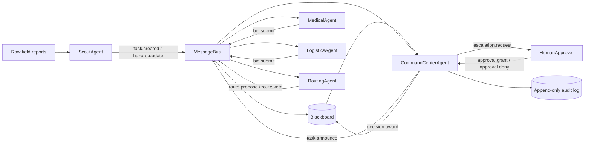

# Disaster Response Multi-Agent System Prototype

This repo prototypes a small multi-agent system (MAS) for disaster-response coordination after an urban flood and aftershock event. It is intentionally lightweight, but it has a real coordination mechanism, a real communication contract, auditability, explicit safety gates, and a worked simulation that shows how the system can fail and recover.

Run it:

```powershell
python -m disaster_mas.simulation
```

Run tests:

```powershell
python -B -m unittest discover -s tests
```

The demo prints a message trace, task awards, human escalations, blocked decisions, and a final system state summary.

Evidence files:

- `examples/sample_run.md` captures an example run of the mocked simulation, including message trace, awards, escalations, blocked decisions, inventory state, and audit log.
- `docs/safety_governance.md` gives a focused safety/governance evidence brief for HITL controls, auditability, rollback, abuse cases, and known failure modes.

## System Brief

**Use case:** Disaster response.

**Stakeholders:**

- Incident command center: accountable for safe resource allocation and final decisions.
- Field scouts: report hazards, needs, and uncertain observations.
- Logistics team: manages supplies, vehicles, staff, and delivery feasibility.
- Medical team: triages casualty needs and estimates care capacity.
- Routing team: evaluates path safety and travel time.
- Human commander: approves high-risk or irreversible actions.
- Affected residents: depend on timely, safe, fair response.

**Objective:** Assign scarce response resources to urgent incidents while avoiding unsafe routes, hallucinated reports, duplicated work, and unapproved high-risk actions.

**Failure stakes:** A bad decision can send responders into a flood zone, delay care for injured people, consume scarce medical supplies, or make command think a rumor is confirmed. The prototype treats safety and auditability as first-class behavior, not post-processing.

## Why MAS

A single agent is not enough because the response requires multiple partially independent views:

- Scouts see local evidence and uncertainty.
- Medical triage optimizes for casualty risk and treatment capacity.
- Logistics optimizes for scarce physical resources.
- Routing optimizes for movement constraints and hazards.
- Command must optimize globally and decide when humans must intervene.

Keeping these roles separate gives the system useful disagreement. A routing agent can veto a fast but unsafe delivery, while a medical agent can argue that a lower-supply task is more life-critical. That tension is the point.

## Agent Roster

| Agent | Responsibilities | Tools | Memory | Permissions |
| --- | --- | --- | --- | --- |
| `ScoutAgent` | Converts raw field reports into typed incident tasks and hazard updates. | Report parser, confidence scoring. | Recent reports, observed hazards. | May create tasks and hazard markers; cannot allocate resources. |
| `MedicalAgent` | Bids on casualty and evacuation tasks using urgency and capacity. | Triage scoring, care-capacity model. | Available med kits, teams, casualty backlog. | May bid and recommend treatment; cannot dispatch alone. |
| `LogisticsAgent` | Bids on supply, shelter, generator, and transport tasks. | Inventory check, vehicle/capacity scoring. | Stock counts, vehicles, staff. | May bid; cannot deplete scarce stock without award. |
| `RoutingAgent` | Scores routes and flags unsafe paths. | Route planner, hazard penalty model. | Blocked zones, road network, route history. | May propose routes and safety constraints; can veto unsafe route choices. |
| `CommandCenterAgent` | Coordinates tasks, collects bids, chooses awards, escalates risky decisions. | Contract-net auction, policy gate, audit writer. | Global task board, bids, decisions, escalations. | May award safe tasks; must escalate high-risk decisions to human. |
| `HumanApprover` | Mocked commander for high-risk actions. | Approval policy script. | Escalation log. | Can approve or deny; denial rationale can request safer alternatives. |

## Architecture



## Communication Contract

All agent communication uses the same message envelope:

```json
{
  "msg_id": "msg-0001",
  "trace_id": "incident-flood-library",
  "sender": "scout",
  "recipient": "command_center",
  "type": "task.created",
  "priority": 5,
  "created_at": "2026-06-28T12:00:00Z",
  "ttl": 8,
  "requires_ack": true,
  "payload": {
    "task_id": "task-library-evac",
    "task_type": "medical_evacuation",
    "location": "Library Shelter",
    "severity": 5,
    "confidence": 0.92
  }
}
```

**Routing:**

- `ScoutAgent -> CommandCenterAgent`: `task.created`, `hazard.update`.
- `CommandCenterAgent -> role agents`: `task.announce`.
- `MedicalAgent / LogisticsAgent / RoutingAgent -> CommandCenterAgent`: `bid.submit`, `route.propose`, `route.veto`.
- `CommandCenterAgent -> HumanApprover`: `escalation.request`.
- `CommandCenterAgent -> Blackboard`: `decision.award`, `decision.blocked`.

**Escalation triggers:**

- Task severity is 4 or higher and route risk is above `0.60`.
- Task confidence is below `0.65`.
- Award would deplete a scarce resource below the reserve floor.
- Routing agent vetoes all feasible routes.
- Two specialist agents disagree by more than the configured utility gap.

**Shared state:** The blackboard stores tasks, hazards, bids, route proposals, awards, escalations, inventory state, and an append-only audit log. Agents can read relevant public state but only write through typed messages handled by the bus.

## Coordination Mechanism

This prototype uses a **hybrid blackboard + contract-net + supervisor gate**.

- **Blackboard:** Good for disaster response because agents need a shared operational picture that changes as hazards and tasks arrive.
- **Contract net:** Good for assigning tasks because each specialist can bid with local knowledge. Bids expose capability, cost, risk, and resource impact.
- **Supervisor gate:** Good for safety because some choices must not emerge from local utility alone. Command applies global policy and sends high-risk cases to a human.

This is preferable to pure consensus here. Consensus would be slower, require every agent to vote on every assignment, and blur accountability. Disaster response needs fast local expertise plus a clear decision authority.

## Incentive Analysis

The agents are cooperative but not identical:

- Medical is rewarded for reducing casualty risk.
- Logistics is rewarded for preserving scarce resources and completing deliveries.
- Routing is rewarded for avoiding unsafe paths, even when that blocks a fast response.
- Command is rewarded for global expected benefit subject to safety policy.

Local objectives can conflict with global objectives. For example, Medical may bid aggressively for evacuation, while Routing blocks the route and Logistics warns that fuel reserves are low. The command center resolves the conflict with a utility function plus hard policy gates.

The system is designed to surface disagreement instead of hiding it. A bid is not just a score; it includes risk, resource impact, rationale, and constraints.

## Emergence

Expected emergent behavior:

- **Implicit prioritization:** Urgent medical tasks attract higher bids and are awarded earlier without hard-coding every scenario.
- **Adaptive rerouting:** New hazard updates change route bids and can cause previously viable assignments to be blocked or escalated.
- **Resource conservation:** Logistics becomes less willing to bid as reserves approach floor thresholds.

Unwanted emergent behavior:

- **Auction starvation:** Low-severity but important tasks may never win when high-severity incidents keep arriving.
- **Risk laundering:** Several medium-risk local decisions can combine into a globally unsafe plan.
- **Confirmation cascade:** A low-confidence scout report could become treated as fact if many agents copy it into their own rationale.
- **Over-escalation:** Strict safety gates can flood the human commander and delay response.
- **Local gaming:** A role agent could inflate or deflate bid scores to protect its own metric.

The prototype counters these with TTLs, confidence propagation, audit logs, resource floors, route vetoes, escalation thresholds, and explicit blocked decisions.

## Interoperability Boundaries

A2A-style boundaries matter where independent agents communicate:

- Message envelopes must stay stable across agent implementations.
- Agents should not call each other's internals; they exchange typed messages.
- Trace IDs let independent systems correlate decisions across a response.

MCP-style boundaries matter where agents use external tools:

- Routing could call a map service.
- Logistics could query warehouse inventory.
- Medical could query hospital capacity.
- Command could write to an incident-management system.

In production, each tool would be permission-scoped and observable. The prototype keeps tools in memory but preserves the boundary shape.

## Operations

**Observability:**

- Every message has `msg_id`, `trace_id`, sender, recipient, type, priority, and TTL.
- The blackboard keeps audit entries for task creation, bids, escalations, awards, denials, and blocked decisions.
- The demo prints a trace and final state summary.

**Evaluation:**

- Agent level: bid calibration error, invalid message rate, unsafe-route proposal rate.
- Interaction level: duplicate assignment rate, escalation precision/recall, disagreement resolution time.
- System level: casualty-risk reduction proxy, time-to-award, resource reserve violations, blocked unsafe actions.
- Human level: commander approval burden, false-positive escalations, trust calibration, after-action review completeness.

**Rollback:**

- Command computes an award candidate before resource mutation.
- If a human denies an escalated decision, the award is not committed.
- The prototype marks denied work `blocked`; a production version would add `needs_replan` and inventory snapshots for reversible dispatches.
- Audit logs support reconstruction; production rollback would add explicit reversal messages.

**Human-in-the-loop controls:**

- Required approval for high route risk, low confidence, scarce resource depletion, or total route veto.
- Human approvals and denials are recorded with rationale.
- The simulated human denies a dangerous low-confidence bridge action and approves a high-urgency evacuation only after a safer route is available.

## Safety And Governance Plan

Main failure cases and mitigations:

| Failure case | Example | Mitigation in prototype |
| --- | --- | --- |
| Unsafe route | Fast route crosses a flooded bridge. | Routing veto plus command safety gate. |
| Low-confidence rumor | Bridge collapse report from one unverified source. | Confidence threshold triggers escalation or blocked decision. |
| Resource depletion | Logistics would use last ambulance or med kit. | Reserve-floor check blocks or escalates award. |
| Agent collusion or bad calibration | Bids become inflated. | Audit bid rationales; compare predicted vs actual outcomes. |
| Human overload | Too many escalations. | Track escalation rate; tune thresholds; bundle related decisions. |
| Stale state | A task is awarded after a new hazard update. | TTLs, route recalculation, and hazard-aware bid scoring. |
| Abuse | Fake report tries to redirect resources. | Source confidence, provenance, and human review for low-confidence high-impact tasks. |

## MARL Bridge

Multi-agent reinforcement learning is not appropriate for the core decision loop at this stage. The environment is high-stakes, sparse-feedback, non-stationary, and legally accountable. A learned policy that discovers a clever shortcut is exactly what command cannot blindly trust.

MARL could be useful offline:

- Stress-test coordination policies in simulation.
- Tune bid weights against historical or synthetic incidents.
- Explore human workload under different escalation thresholds.
- Train adversarial scenario generators that reveal brittle policies.

For live operation, the safer bridge is constrained learning around interpretable policies, with hard-coded safety gates and human approval.

## Prototype Scenario

The demo runs four scripted events:

1. A flooded library shelter has injured residents and needs evacuation.
2. A clinic needs generator fuel and medical supplies.
3. A low-confidence bridge-collapse rumor arrives.
4. A hazard report blocks a road and forces rerouting.

You should see:

- Agents publish typed messages.
- Command announces tasks.
- Medical, Logistics, and Routing submit bids or route proposals.
- Unsafe or uncertain tasks escalate to the human approver.
- Some tasks are awarded, one is blocked, and the audit log explains why.

## Repository Layout

```text
docs/
  safety_governance.md
disaster_mas/
  __init__.py
  agents.py
  blackboard.py
  messages.py
  simulation.py
examples/
  sample_run.md
tests/
  test_safety.py
README.md
pyproject.toml
```

## Grading Rubric Map

| Rubric category | Where covered |
| --- | --- |
| Use-case quality and stakeholder framing | System Brief, Why MAS |
| Agent role design and boundaries | Agent Roster |
| Communication protocol and architecture | Architecture, Communication Contract |
| Coordination and incentive design | Coordination Mechanism, Incentive Analysis, Emergence |
| Prototype, simulation, or worked scenario | `python -m disaster_mas.simulation`, `examples/sample_run.md` |
| Evaluation, observability, and safety | Operations, Safety And Governance Plan, `docs/safety_governance.md`, `tests/test_safety.py` |
| Presentation and clarity | This README plus runnable code |
